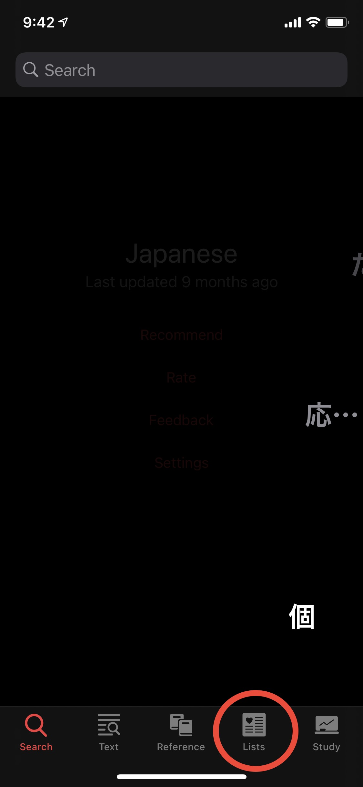
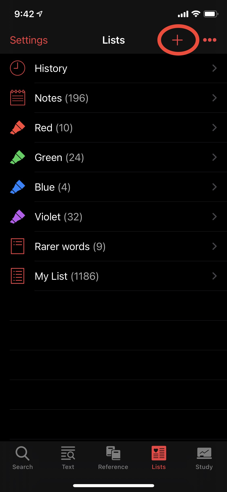
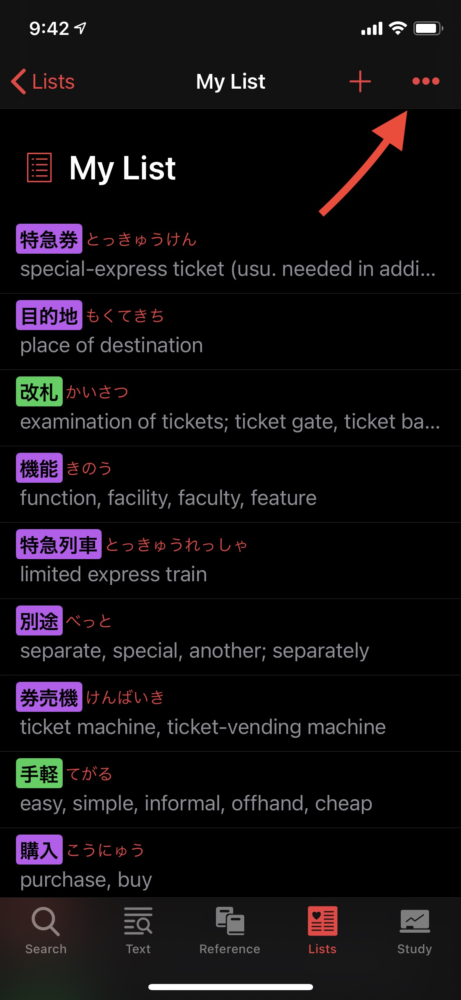
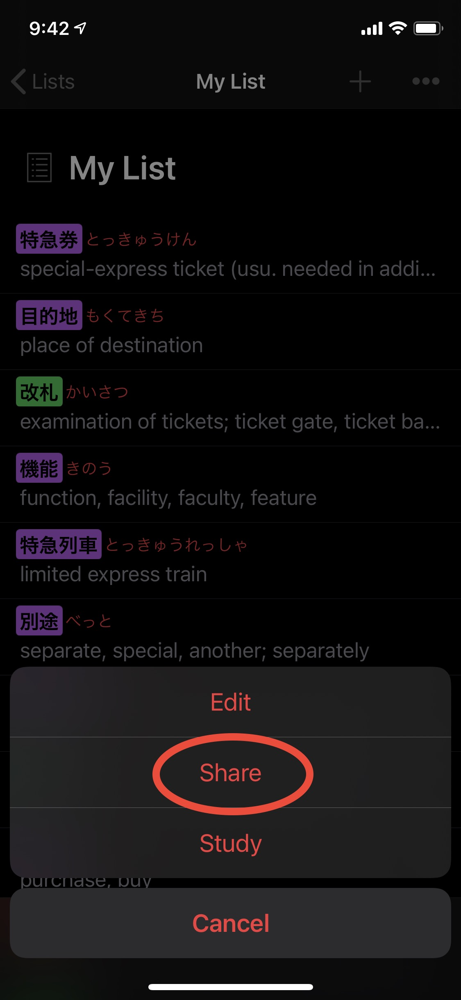
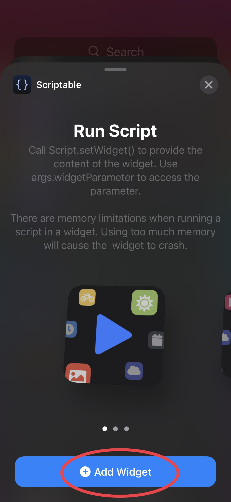
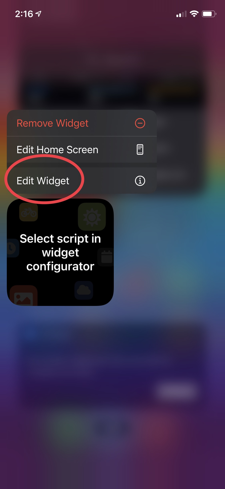
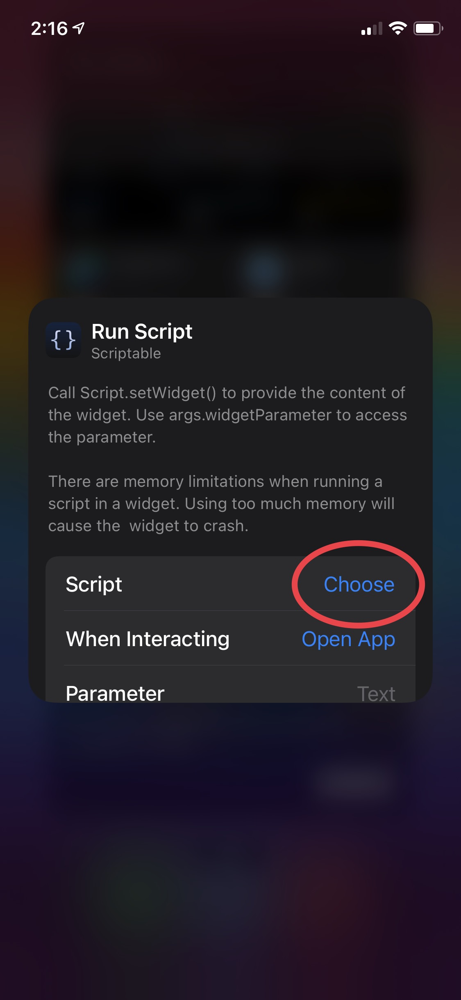

# Widget for Japanese app

This [Japanese dictionary app](https://apps.apple.com/us/app/japanese/id290664053), made by [Renzo Inc](https://www.japaneseapp.com), hasn't been updated with widgets yet, so I decided to take matters into my hands and this is the outcome – a widget created via Scriptable to display words and meanings exported by the Japanese app. You can also interact with the widget to open the word directly in the Japanese app.

## Getting Started

To get started, you need to export a list of words created in the Japanese app. If you have created one before, you'll find them on the 'Lists' tab within the app. I recommend using [this Shortcut](https://www.icloud.com/shortcuts/6a3070ac49c54502ab44905f74a2c353) I created to help to setup the widget.

## Prerequisites

- [Scriptable](https://apps.apple.com/us/app/scriptable/id1405459188)
- [Japanese](https://apps.apple.com/us/app/japanese/id290664053)

## Installing

### STEP 1
*Make sure you have both apps from the prerequisites section installed before continuing*

Install the [Add To Japanese Widget](https://www.icloud.com/shortcuts/6a3070ac49c54502ab44905f74a2c353) shortcut to your Shortcuts app.

Run the Shortcut once to download the necessary files.

### STEP 2
Open the [Japanese](https://apps.apple.com/us/app/japanese/id290664053) app, go to the Lists tab, open your list, tap the *...* button, tap *Share* and tap *Add To Japanese Widget* shortcut.

Open your Lists | Create a List if you haven't already | Tap ... button | Tap Share and Add To Japanese Widget
--- | --- | --- | ---
 |  |  | 

### STEP 3
Add Scriptable widget, tap & hold the widget and tap *Edit Widget*, tap *Choose* and select *Japanese Widget*.

Add Widget | Open Widget configurator | Tap Choose and select Japanese Widget
--- | --- | ---
 |  | 

## Authors

* **Felipe Manoeli** - [MaximiliumM](https://www.twitter.com/MaximiliumM)

## Acknowledgments

* [@simonbs](https://www.twitter.com/simonbs) for helping me figure out the URL encoding bug :D 
* This work has no association with Renzo Inc.
